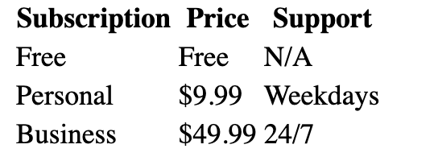

# Table Practice Exercise
It's time to get some practice with all those table-related elements! (yikes)  Your goal is to create a 3x3 table, with proper headings. (so it's really 4x3 if you count the heading cells)  I've provided you with some starter data in `index.html`, though you do not have to use it.  Just make sure you create a 3x3 table with a row of headings at the top, using the correct semantic elements. You are expected to use the following elements: `table`, `thead`, `tr`, `th`, `tbody`, and `td`

Here is what the table would look like with the starter data provided in `index.html`:

