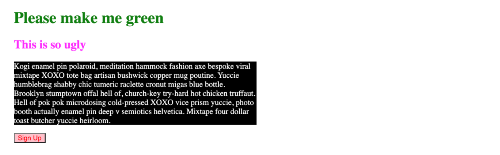

# The Very Basics Exercises
## 01 :: Our First CSS Exercise
Time for some basic CSS practice! I've provided you with some basic HTML markup in index.html, please don't touch it!  I've also made a styles.css file for you to work in.  Please style the elements according to these rules:

- h1s
     - green text
- h2s
     - magenta text
- paragraphs
    - white text
    - black background color
- buttons
    - red text
    - pink background color

If done correctly, you'll see this stunningly beautiful result:

## 02 :: Hipster Logo Exercise
I'm opening up a very hip artisanal vodka company called Purple Grain. Please help complete my incredibly ugly logo. Style the `<h1>` with the following styles:

- uppercase all the letters, without touching the html! (note: you weren't taught how to do this, you will need to flex your googling skills)
- set the font-family to be 'monospace'
- center align the text
- set the font weight to 100
- make the text size 40px
- set spacing between letters to 20px
- add a wavy plum underline (plum is the color) - I can't test this, but make sure it looks like the image!

