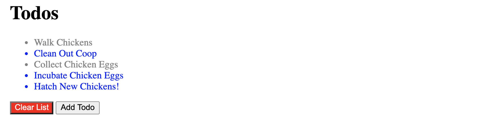
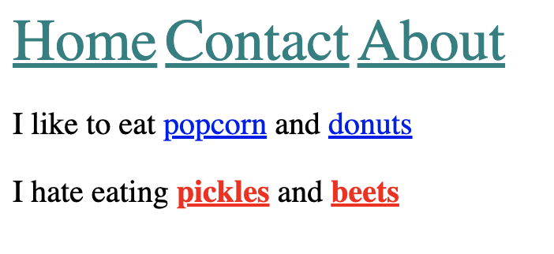
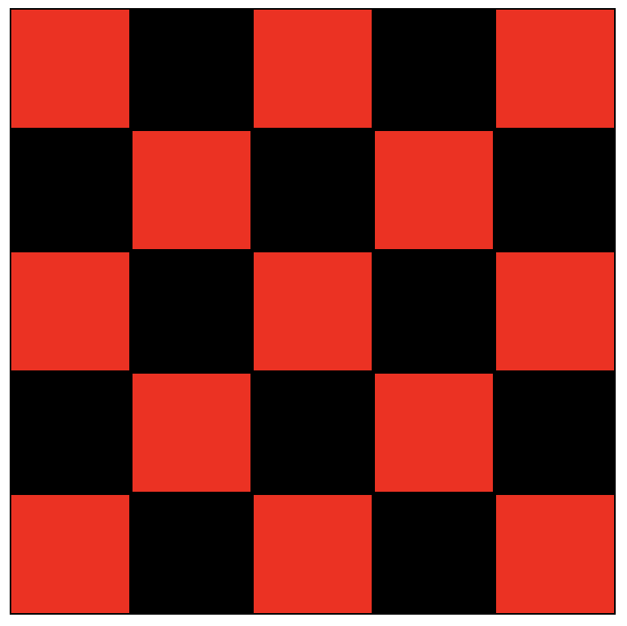

# Selectors Exercises
## 01 :: Basic Selector Practice

It's time to get some practice with the new CSS Selectors we just learned. Without touching any of the starter HTML code in `index.html`, write CSS in app.css according to these rules:

- Give all li elements the text color blue
- Give all elements with the class of done the text color grey
- Give the element with the id clear a red background and white text

## 02 :: Descendant Combinator Practice
Using what we just learned about the descendent combinator, write styles in app.css to accomplish the following:

**(don't change any markup in `index.html`, please!)**

- Give only the links in the header :
    - font size of 30px
    - color of teal
- Give only the links inside the paragraph with the id 'dislikes':
    - bolded
    - color of red

Your result should look like this:

## 03 :: Checkerboard Exercise
The `index.html` file contains 25 `
` elements, each with the class of `square`. Please create a simple checkerboard pattern by making the **even squares black** and the **odd squares red**.  Your result should look like the image below.  Please write your styles in `app.css`, and do not change any of the styles in `NO_TOUCHING.css` :)

**Please note:** the solution needs to select both the even and odd squares, changing the background color of the entire board will work visually, but will not pass the exercise parameters.

