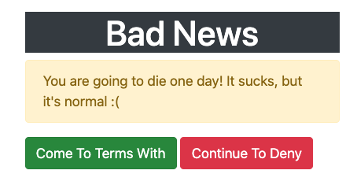

# Bootstrap Exercises
## 01 :: Bootstrap Basics Practice
I've given you some starter markup in index.html.  Bootstrap is already included! Please add in the appropriate bootstrap classes according to these instructions:

- Make the section a bootstrap container
- Give the h1 white text, a dark background, and center-aligned text
- Make the div an alert ('warning' color).  Set the role attribute to alert, for accessibility purposes!
- Make the first button a green bootstrap button
- Make the second button a red bootstrap button

## 02 :: Bootstrap Grid Practice
Please recreate the layout pictured below. I've included bootstrap for you, but you'll need to create all the relevant markup (container, row, column, etc.). I'm not testing your code for the specific colors, but I recommend giving the columns background colors so that you can differentiate them. I'm also not testing for the specific text in each column.

**Please note:** Although bootstrap will allow you to use col without a column size to automatically fill the remaining space in the row (and that would normally be an acceptable solution), the tests for this exercise will not recognize that as a correct solution. So, please be sure to explicitly include the column size for each individual col-* class.