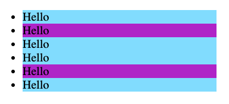

# Basics Exercises
## 01 :: getElementById Practice
Let's get some practice using `getElementById`. I've provided a little bit of markup for you (please don't change it!)  Your goal is to write code in `app.js` to select the following elements using `getElementById`:
* Select the image element by its id and save it to a variable called `image`
* Select the h1 by its id and save it to a variable called `heading`

**Note**: You may need to reset the code before attempting this exercise

## 02 :: querySelector Practice
I've provided you with some simple markup in `index.html`.  Your task is to use `querySelector` and `querySelectorAll` to select some of those elements.
* Select **all** elements that have the class of `"done"` and save them in a variable called `doneTodos`.
* Select the **one** `checkbox` and save it in a variable called `checkbox`. Be careful, there is more than one input element on the page! You'll need to select using the type attribute. (if you can't remember the css attribute selector...google it! That's what I would do!)

Write your code in `app.js`. **Please do not change any of the elements in `index.html`**

## 03 :: Pickles Exercise
I've provided you with some basic markup in `index.html`
* Please use JavaScript to select the `` element that currently reads "Delicious"
* Change its text to read **"Disgusting"** USING JAVASCRIPT. Even if you are a weirdo who likes pickles, please change the text to "Disgusting". 
* Yes, you could cheat and just update the html file directly, but I hope you don't!  The goal here is to practice using JavaScript to manipulate HTML.

## 04 :: Manipulating Attributes Practice
Let's get some practice working with DOM element attributes. I've provided you with some very basic markup.  **Please select the image element and**:
* change its source to this url: `https://devsprouthosting.com/images/chicken.jpg`
* change its alt text to be `"chicken"`

## 05 :: Magical Forest Circle Exercise
I've provided you with some basic markup in `index.html`.  **Please do not change any of the markup directly**.  Instead, use JavaScript to make the following changes:
* Select the `div` with the `id` of `container`.  Using JavaScript, set it's text alignment to `'center'`;
* Select the image and use JavaScript to give it a width of `150px` and a border radius of `50%`

**Remember to use camelCased property names in JavaScript! (`backgroundColor`, not `background-color`, etc.)**

## 06 :: Rainbow Text Exercise
I've provided you with an `<h1>` element which contains 7 individual spans (each holding a single letter). 
* Please write some JavaScript to make them rainbow-colored! 
* In app.js you'll find an array of color names called `colors`.  It looks like: `['red', 'orange', 'yellow', 'green', 'blue', 'indigo', 'violet']`.
* **Your task is to select all spans, iterate over them, and assign them each one of the colors from the colors array**.  The first span should be red, the second should be orange, etc.   Your result should look like this:

## 07 :: ClassList Practice
In `index.html`, you'll find 6 `<li>` elements, two of which have the `'highlight'` class applied to them.
* Please use JavaScript and the **`classList` property** to invert which elements have the `highlight` class.
* Basically iterate over all the `<li>` elements and toggle the class of `'highlight'` on each one. Your end result should look like this:

**Please don't touch the markup in `index.html`! Do this all via JavaScript!**