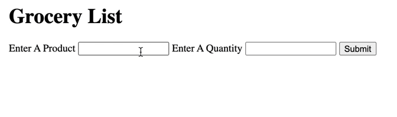

# Basics Exercises
## 01 :: Know Thy Enemy Exercise
In this exercise, I'm asking you to write some inline event handlers **WHICH IS NOT SOMETHING I RECOMMEND, but hopefully it will illustrate to you just how annoying it can be**. In `index.html`, you'll find an `<h1>` element and a `<button>`.  Please add two inline click handlers directly in the html:
* When the h1 is clicked, you should print*  "boo"
* When the button is clicked, you should print "clicked"

    "print" = `console.log('something here');` 

 

## 02 :: Click Events Exercise
Let's get some practice using `addEventListener`. I've provided you with two buttons, each with an id: `'hello'` and `'goodbye'`.  Your goal is to add a click listener to each button. 
* When the `hello` button is clicked, you should console.log `"hello"`
* When the `goodbye` button is clicked, you should console.log `"goodbye"`

**Make sure to use `addEventListener`!**

## 03 :: Form Events Exercise
Time to get some practice working with forms and form events! `index.html` already has a form element that contains two `<input>` elements, one for quantity and one for a product name.  `index.html` also contains an empty `<ul>` where you will append new `<li>`'s.  **Watch the gif at the bottom for an overview of how your code should work**. Your task is to follow these steps:
* Listen for the form submission
* When the form is submitted, prevent the default behavior
* Grab the quantity input value and the product input value
* Create a new `<li>` element.  Set the text on the new `<li>` to include the quantity and product name from the form.
* Append the new `<li>` to the `<ul>` on the page
* Reset the inputs

**Please note**:
The form will need to be assigned to a variable named `form` for the test to pass, I've already included this line of code for you in the `app.js` code.
;

## 04 :: Input Event Practice
It's time to practice working with the **input event**!  In the `index.html` file, you'll find an `<h1>` and an `<input type="text">` element.  Please do not change anything in `index.html`!  In `app.js`, write code that meets these requirements:

The `h1` should start with the text `"Enter Your Username`" (I've done that for you, already in the markup)

Whenever an input event is fired on the `<input>` element, update the `<h1>` so that it displays `"Welcome, "` plus the current value from the text input.  Take a look at the gif below to see how it should work.

If the `<input>` goes back to being empty, update the `<h1>` so that it once again says `"Enter Your Username"`

;

**Note: In the gif you can see the h1 is updating as I type, rather than whenever I leave the input.  Be sure to listen for an input event, rather than a change event.  Rewatch the previous video for more information!**